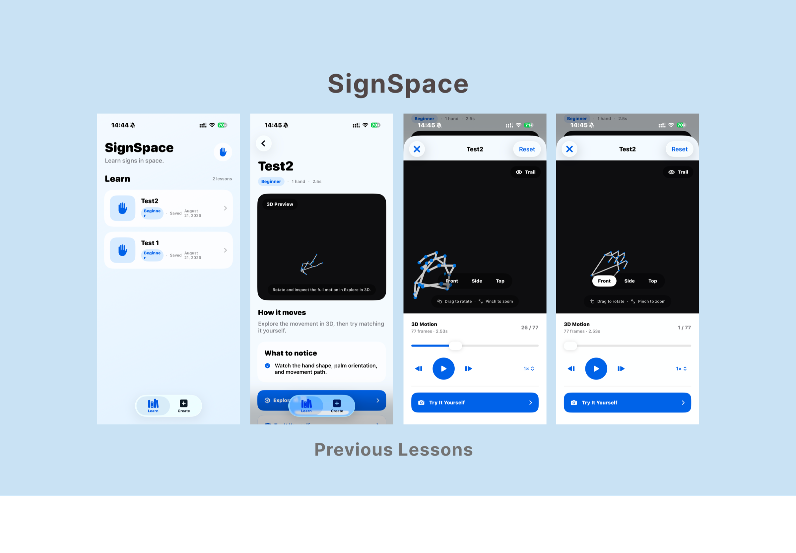
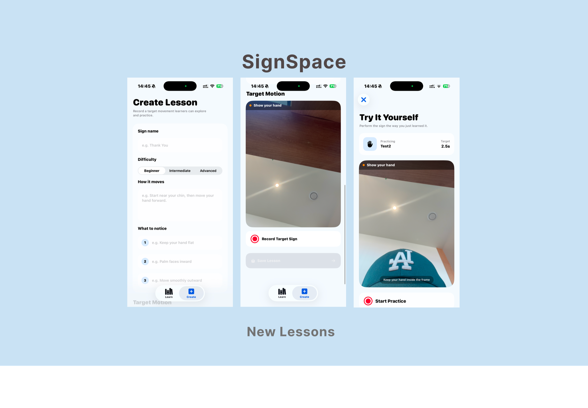

# SignSpace

SignSpace is an iOS sign language learning app that combines interactive 3D visualization with real-time hand tracking. Learners can inspect a sign from multiple angles, practice it using the device camera, and receive movement-based feedback.



## Features

- Explore recorded signs as interactive 3D hand animations
- Rotate between front, side, and top views
- Scrub through motion frame by frame and display a movement trail
- Practice signs with real-time, on-device hand landmark tracking
- Compare a learner's motion against the target sign
- Review scores for hand shape, movement path, palm orientation, and timing
- Create custom lessons with difficulty levels and practice notes
- Save lessons locally for later practice



## How it works

1. Choose a lesson from the sign library.
2. Explore the target movement in the interactive 3D viewer.
3. Record your attempt with the front-facing camera.
4. SignSpace aligns your motion with the target and evaluates key movement characteristics.
5. Review your scores and feedback, then practice again.

## Tech stack

- **SwiftUI** — app interface and navigation
- **RealityKit** — interactive 3D hand visualization
- **MediaPipe Tasks Vision** — real-time hand landmark detection
- **AVFoundation** — camera capture and video-frame processing
- **SwiftData** — local lesson persistence

## Requirements

- iOS 17.0+
- Xcode 15+
- CocoaPods
- A physical iPhone is recommended for camera-based hand tracking

## Getting started

```bash
git clone https://github.com/jaewonparkk/SignSpace.git
cd SignSpace
pod install
open SignSpace.xcworkspace
```

Select an iOS device or simulator in Xcode and run the `SignSpace` scheme. Camera-based practice requires camera permission and works best on a physical device.

## Privacy

Camera frames are processed for hand tracking during lesson creation and practice. Lessons and recorded motion data are stored locally on the device using SwiftData.

## Project status

SignSpace is an active prototype focused on making sign-language movement easier to understand through spatial visualization and immediate practice feedback.
